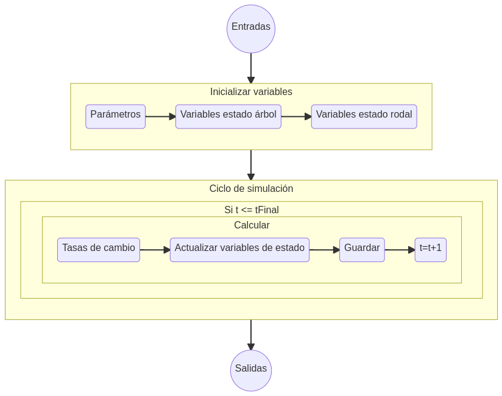

--------

## Manual del usuario
Existen diversas aproximaciones para modelar el crecimiento de bosques [@munro74;@aaronbook;@salasmodcreci]. 
 Al ser *Pellín* un simulador a nivel individual es necesario contar con información a nivel de árbol en una unidad de superficie (e.g., lista de árboles en una  parcela de muestreo), además de conocer la ubicación geográfica   de la lista de árboles y el horizonte   de simulación (Fig. 1).

|  |
|:--:|
| <b>Figura 1: Elementos necesarios para simular en *Pellín*. </b>|

En el 
[manual del usuario](manualPellin.pdf) se detalla paso a paso como usar el simulador.

## Descripción del modelo
En esta sección se entregan antecedentes más específicos respecto a los componentes que integran al modelo de crecimiento implementado en *Pellín*.

El diagrama de la figura 2 describe el flujo general 
del sistema de simulacion de *Pellín*. Lo primero
es leer los **datos de control** (lo cual se simplifica
como **Entradas** en el diagrama), lo que corresponde
no tan solo a verificar el archivo con el listado de arboles, sino
que tambien leer las definiciones para realizar
la simulacion, como lo son el horizonte de simulacion
 y cargar los parametros necesarios de los modelos internos
 a ser empleados. Luego de leidos estos datos de control, se **inicializan
 las variables** de estado a nivel de arbol y rodal, para
 el tiempo actual o inicial de simulacion. Esto en terminos computacionales equivale a una lista de informacion cuantitativa.
 El fundamento del simulador es el ciclo que iterativamente resuelve
 al sistema dinamico de ecuaciones que lo conforman. Dentro del **ciclo
 de simulacion**,
 para cada variable de estado (tanto a nivel de arbol como de rodal),
 se calcula su nuevo valor en base a su tasa de cambio, y se actualiza
 el valor del listado de arboles. Posteriormente, se aumenta
 el lapso de tiempo $\Delta t$, en el caso de *Pellín* igual a 1,
 y se inicia el ciclo nuevamente. Cuando el tiempo iguala al maximo
 estipulado de simulacion, se detiene el proceso y se procede
 a generar las **salidas**.
 
|  |
|:--:|
| <b>Figura 2: Flujo general del simulador *Pellín*. </b>|

 
El modelo de crecimiento a partir de las variables
de tamaño de un bosque (i.e., lista de árboles),
 define la estructura de este, representandola mediante variables de rodal agregada y de orden, y 
  variables que definen la competencia. Posteriormente,
   se calcula la probabilidad de mortalidad de cada individuo, y con los que sobreviven se predice sus
   respectivos incrementos en tamaños para el siguiente ciclo. De esta manera se genera una nueva lista de árboles que entra a un nuevo ciclo.
 Esto se expresa en el siguiente flujo de componentes.

## Otros relacionados
Una caractertística importante para el equipo desarrollador ha sido el trabajo científico detras del modelo de crecimiento. Para esto, los autores han sometido a revision de pares muchas de las ideas que sustentan a *Pellín*. Algunos trabajos donde se pueden revisar mayores detalles científicos en los cuales se basa el modelo son: @salascapitulo18,  @salasweis18, @salas20, @salasweis20, @salas21, @salas21stem, @salasgreq.

--------
## Referencias bibliográficas

<!--- 
áfica]--Tiene la información
flowchart LR
    id1[(Ubicacion geografica parcela)]--id2[(Lista de arboles)]
output: html_document

**Some of my older websites**
Pellín: un simulador de crecimiento de bosques nativos

output: 
  html_document:
    toc: FALSE
    
    

    
-->
