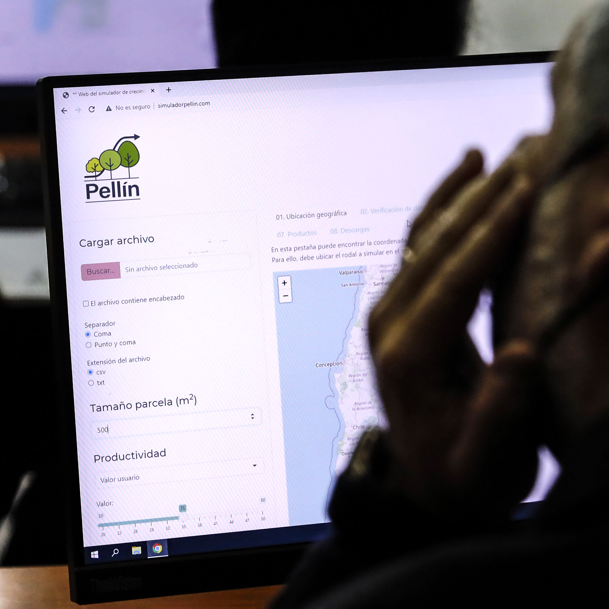

 &nbsp;&nbsp;&nbsp;&nbsp;&nbsp;&nbsp;&nbsp;&nbsp;&nbsp;&nbsp;&nbsp;&nbsp;&nbsp;&nbsp;&nbsp;&nbsp;&nbsp;&nbsp;&nbsp;&nbsp;&nbsp;&nbsp;&nbsp;&nbsp;&nbsp;&nbsp;&nbsp;&nbsp;&nbsp;&nbsp;&nbsp;&nbsp;&nbsp;&nbsp;&nbsp;&nbsp;&nbsp;&nbsp;&nbsp;&nbsp;&nbsp;&nbsp; 

<!--- 
 **Pellín: un prototipo de simulador de crecimiento de bosques nativos en Chile**
-->

## Contexto
Este sitio web es la puerta de entrada a *Pellín*: un prototipo de simulador de crecimiento de bosques nativos.  Este simulador se basa en un modelo de crecimiento que es un sistema de ecuaciones matemático-estadísticas que predice el cambio de variables de estado en el tiempo para bosques naturales en Chile. En específico, esta versión esta desarrollada para bosques secundarios dominados por
 *Nothofagus obliqua* (roble), *N. alpina* (raulí), y *N. dombeyi* (coihue) en el centro-sur de Chile. Este tipo de bosques son conocidos en Chile como renovales del tipo forestal roble-raulí-coihue [@donosotipfor1981], y han
 sido caracterizados en diversos estudios [@puente79; @donosobtempla1st;@grosseq99;@salascapitulo18].

*Pellín* es un prototipo de simulación de bosques basado
 en un modelo de crecimiento a nivel de árbol individual independiente de la distancia e independiente de la edad. 
 El modelo se basa en un trabajo de modelación que se ha venido llevando a cabo bajo la dirección del Profesor
 <a href="https://eljatib.com" target="_blank">Christian Salas-Eljatib</a> y con la participación del  [equipo](./team.html) de co-investigadores, colaboradores,  asistentes de investigación y estudiantes.

## Precaución
Tal como se indicó anteriormente, este simulador es un prototipo, y una serie de mejoras e implementaciones serán realizadas en el futuro cercano. 
 Se espera que mientras se le de uso a *Pellín*, aparezcan problemas que deberán ser solucionados, por lo cual es vital contar con la retroalimentación de los usuarios.
 Es por esta razón, que se invita a los usuarios de *Pellín*, que nos indiquen potenciales problemas con este mismo, así como también en el caso de estar interesad@ en contribuir a la mejora de este.

En este mismo contexto, es necesario aclarar que el uso del presente prototipo es realizado bajo la completa
 responsabilidad del usuario, y en caso del equipo desarrollador
 no asume responsabilidad alguna. 
 
--------
## Referencias bibliográficas

<!--- 

## El modelo

output: rmdformats::readthedown
bibliography: mybib.bib
link-citations: no
output: rmdformats::readthedown

output: 
  html_document
  This is my text number 6

output: rmdformats::readthedown
https://www.andreashandel.com/posts/github-website/
output: 
  html_document
-->