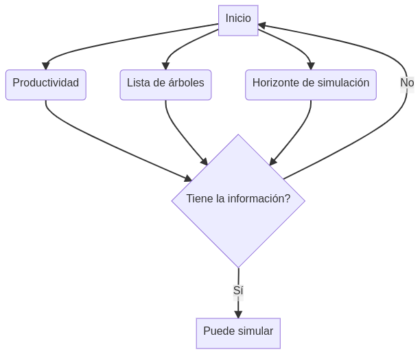

--------

## Usando el simulador
Al ser *Pellín* un simulador a nivel individual es necesario contar con información a nivel de árbol en una unidad de superficie (e.g., lista de árboles en una  parcela de muestreo), además de conocer el nivel
de productividad (o la ubicación geográfica) del lugar
 donde se encuentran estos árboles y el horizonte   de simulación (Fig. 1).

|  |
|:--:|
| <b>Figura 1: Elementos necesarios para simular en *Pellín*. </b>|

Para simular en *Pellín* Ud debe:

1. [x]   Leer el [manual del usuario](manualPellin.pdf)

2. [x]   Ingresar al siguiente [enlace](https://biometriabosques.shinyapps.io/Pellin/) 

Mayores detalles técnicos son entregados en  la sección [que
 describe el modelo detras del simulador](./docs.html).

## Ejemplo de lista de árboles   
 Acá se entregan archivos, a modo de ejemplo, 
 con el listado de árboles para algunas 
 parcelas de muestreo.

| Parcela| Archivo | Superficie parcela (m2) |
|:--:|:--:|:--:|
|1 | [parcela01.csv](data/parcela01.csv) | 500 |
|2 | [parcela02.csv](data/parcela02.csv) | 500 |
|3 | [parcela03.csv](data/parcela03.csv) | 250 |

## Ejercicio de simulación   

Para ejercitar con el simulador
 *Pellín*, responda el siguiente 
[ejercicio práctico](testPellin.pdf).

## Actualizaciones   

Revisar [acá](./updates.html) 

--------
<!--- 
2. [x]   Ingresar al siguiente [enlace](./updates.html) 

## Referencias bibliográficas

2. [x]   Ingresar al siguiente [enlace](https://biometriabosques.shinyapps.io/Pellin/) 

1. [x]   [parcela01.csv](data/parcela01.csv)
2. [x]   [parcela02.csv](data/parcela02.csv)
3. [x]   [parcela03.csv](data/parcela03.csv)

**Some of my older websites**
Pellín: un simulador de crecimiento de bosques nativos

output: 
  html_document:
    toc: FALSE
    
    

    
-->
